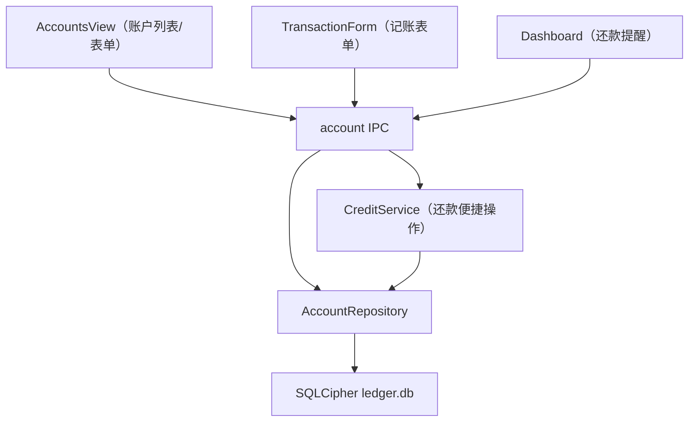

# 设计文档 - 银行卡卡号与信用卡管理

Feature Name: account-credit-rental（第一阶段）
Updated: 2026-08-11

## Description

为 tally 账户体系补充卡号信息与信用卡账户类型。信用卡消费记支出流水（欠款增加）、还款记收入流水（欠款减少），账户余额天然以负值呈现欠款；剩余可用额度 = 信用额度 + 余额。收租管理见 `rental-management` spec。

## Architecture



- 账户与流水仍走既有 IPC 通道；新增 `credit.repay` 通道承载「信用卡还款」原子操作。
- 余额/剩余额度由存储层聚合 SQL 计算，前端不缓存，保证删除/编辑流水后自动一致。

## Components and Interfaces

| 组件 | 职责 | 变更 |
|------|------|------|
| `schema.ts` | 建表与迁移 | `SCHEMA_VERSION` 升至 2，`account` 表重建，新增 `credit` 类型与卡号/额度/账单日/还款日列 |
| `AccountRepository` | 账户 CRUD 与余额聚合 | 输入/输出扩展 `cardNumber`/`creditLimit`/`billDate`/`dueDate`；`accountBalance` 返回剩余额度与还款日 |
| `CreditService`（新增） | 信用卡还款便捷操作 | 事务内创建「还款账户支出流水 + 信用卡收入流水」 |
| `account.handler` / `credit.handler`（新增） | IPC 层 | 注册新通道 |
| `preload/index.ts` | 暴露 `window.api` | 新增 `credit.repay` 与账户新字段透传 |
| `AccountsView.vue` | 账户列表与表单 | 卡号/信用卡字段、掩码展示、剩余额度、还款日提醒 |
| `TransactionsView.vue` | 记账表单 | 信用卡账户选择、还款入口 |

## Data Models

`account` 表（迁移后）：

```sql
CREATE TABLE account (
  id INTEGER PRIMARY KEY AUTOINCREMENT,
  name TEXT NOT NULL,
  type TEXT NOT NULL CHECK(type IN ('cash','bank','alipay','wechat','credit','other')),
  card_number TEXT,
  credit_limit REAL NOT NULL DEFAULT 0,
  bill_date INTEGER,
  due_date INTEGER,
  initial_balance REAL NOT NULL DEFAULT 0,
  sort_order INTEGER NOT NULL DEFAULT 0,
  archived INTEGER NOT NULL DEFAULT 0,
  created_at INTEGER NOT NULL
);
```

类型定义扩展：

```ts
export type AccountType = 'cash' | 'bank' | 'alipay' | 'wechat' | 'credit' | 'other'
export interface Account {
  id: number
  name: string
  type: AccountType
  cardNumber?: string
  creditLimit: number
  billDate?: number   // 1-31
  dueDate?: number    // 1-31
  initialBalance: number
  sortOrder: number
  archived: boolean
  createdAt: number
}
export interface AccountBalanceItem {
  accountId: number
  accountName: string
  balance: number          // 信用卡为负欠款
  creditLimit: number      // 信用卡可用额度
  dueDate?: number
}
```

### 迁移策略（v1 → v2）

1. `PRAGMA foreign_keys = OFF`（避免 DROP 被 transaction 外键阻止）
2. 新建 `account_new`（含新列与 CHECK）
3. `INSERT INTO account_new (id,name,type,initial_balance,sort_order,archived,created_at) SELECT ... FROM account`
4. `DROP TABLE account` → `ALTER TABLE account_new RENAME TO account`
5. 重建依赖 account 的索引，恢复 `foreign_keys = ON`
6. `user_version = 2`

## Correctness Properties

1. **信用卡余额 = 初始余额 + Σ收入 − Σ支出**（消费减、还款加），负值即欠款。
2. **剩余额度 = credit_limit + 余额**（仅当余额为负时有效；余额非负时按 credit_limit 展示）。
3. **卡号掩码**：至少保留后四位明文，前段以 `*` 填充；卡号长度小于 4 时展示原样。
4. **还款便捷操作原子性**：还款账户支出与信用卡收入必须在同一事务中创建，任一失败整体回滚。
5. **还款日提醒**：仅当信用卡存在欠款（余额 < 0）且当前日期落在「还款日 − 3 天，还款日」区间时触发。
6. **卡号搜索**：按卡号去除空格与连字符后的末四位匹配。

## Error Handling

| 场景 | 处理 |
|------|------|
| 卡号含非数字/空格/连字符 | 表单校验拦截，提示「卡号仅支持数字、空格与连字符」 |
| 账单日/还款日不在 1-31 | 表单校验拦截 |
| 信用额度为负数 | 校验拦截，必须 ≥ 0 |
| 还款金额大于还款账户余额或大于信用卡欠款 | 前端二次确认提示，不硬性阻断 |
| 还款流水创建失败 | 事务回滚，返回错误码，不产生部分流水 |

## Test Strategy

- **存储层**：v1→v2 迁移保留既有数据与索引；信用卡余额/剩余额度聚合（含多笔消费与还款）；`CreditService.repay` 事务原子性（模拟失败回滚）。
- **组件测试**：账户表单卡号格式校验、信用卡专属字段渲染、掩码切换展示。
- **E2E**：创建信用卡账户 → 记录消费 → 断言余额为负欠款 → 执行还款操作 → 断言余额回正且还款账户支出生成。
