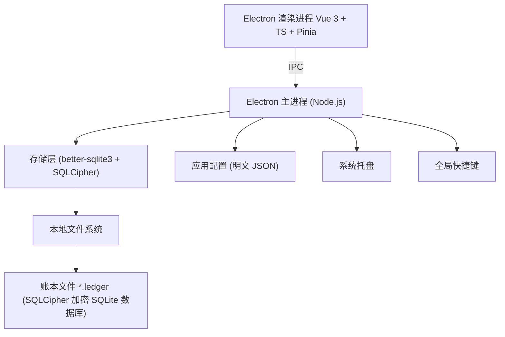
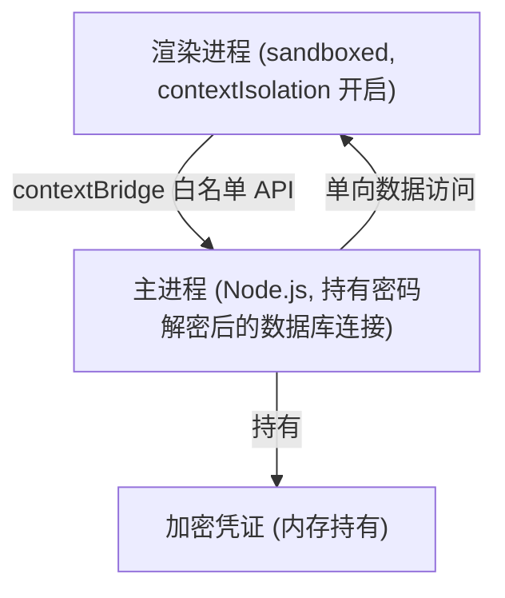
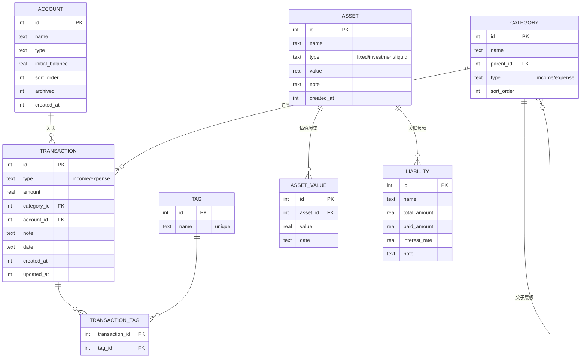

# 单机版桌面财务工具 - 技术设计文档

Feature Name: desktop-finance-tool
Updated: 2026-08-07

## 描述

基于 Electron 的跨平台单机桌面财务工具，数据采用 SQLCipher（SQLite 数据库级 AES-256 加密）存储于本地文件，完全离线运行。前端使用 Vue 3 + TypeScript。提供记账、账户、资产、分析与标签管理能力，并支持系统托盘与全局快捷键。面向注重数据隐私的个人用户。

## 技术选型决策

| 决策点 | 结论 | 理由 |
|--------|------|------|
| 应用框架 | Electron | 跨平台、成熟生态 |
| 前端栈 | Vue 3 + TypeScript + Vite | 用户指定，模板简洁 |
| 状态管理 | Pinia | Vue 3 官方推荐 |
| 图表库 | ECharts | 功能全面，支持导出图片 |
| 数据库 | SQLCipher (better-sqlite3 的 SQLCipher 变体) | 数据库级 AES-256 加密，无需整文件重写 |
| 系统集成 | 系统托盘 + 全局快捷键 | 用户指定，快速记账 |
| UI 组件库 | Element Plus | 成熟、中文支持良好 |

## 架构

### 总体架构

### 进程与安全模型

**安全原则：**

1. 渲染进程通过 contextBridge 暴露最小 API 集合，不直接访问 Node.js 能力
2. 加密密码仅在主进程内存中持有，不持久化
3. 所有文件系统操作在主进程完成

## 组件与接口

### 组件列表

| 组件 | 职责 |
|------|------|
| `main-process` | 应用生命周期、窗口管理、系统托盘、全局快捷键、IPC 处理、账本打开/关闭 |
| `crypto-service` | SQLCipher 密码派生（PBKDF2）、账本文件解密验证、密钥内存管理 |
| `storage-service` | SQLCipher 数据访问、事务管理、数据模型操作 |
| `renderer-app` | 前端界面（Vue 3 + Pinia + Element Plus + ECharts） |
| `backup-service` | 账本备份与恢复 |
| `export-service` | CSV / JSON 导出 |

### 加密机制

- 数据库引擎：SQLCipher（SQLite 的 AES-256 加密版本）
- 密钥派生：PBKDF2-HMAC-SHA256，密码 + 随机 Salt，迭代 600,000 次
- 加密作用域：数据库页级别加密，整个数据库文件无明文内容
- 密钥持有：密码仅在打开账本时用于派生密钥，密钥存于主进程内存，不落盘
- 每次打开/恢复账本时以 `PRAGMA key` 注入密钥并执行 `PRAGMA cipher_migrate` 兼容校验

### IPC 接口（contextBridge 暴露）

| 接口名 | 方法 | 说明 |
|--------|------|------|
| `ledger.open(path, password)` | Promise\<LedgerMeta\> | 打开账本并验证密码 |
| `ledger.create(path, password, name)` | Promise\<LedgerMeta\> | 新建加密账本 |
| `ledger.close()` | void | 关闭当前账本（释放内存） |
| `ledger.getLastUsed()` | Promise\<string\> | 获取上次使用账本路径 |
| `transactions.list(filter)` | Promise\<Transaction[]\> | 分页查询流水 |
| `transactions.create(data)` | Promise\<Transaction\> | 新建流水 |
| `transactions.update(id, data)` | Promise\<Transaction\> | 编辑流水 |
| `transactions.delete(id)` | Promise\<void\> | 删除流水 |
| `accounts.*` | - | 账户 CRUD |
| `assets.*` | - | 资产 CRUD |
| `categories.*` | - | 分类 CRUD |
| `tags.*` | - | 标签 CRUD |
| `analytics.query(query)` | Promise\<AnalyticsData\> | 数据分析查询 |
| `backup.create(path)` | Promise\<void\> | 备份当前账本 |
| `backup.restore(path, password)` | Promise\<void\> | 从备份恢复 |
| `export.toCsv(data, path)` | Promise\<void\> | 导出 CSV |

## 数据模型

### 账本文件格式

账本文件为 SQLCipher 加密的 SQLite 数据库文件（扩展名 `.ledger`），数据库页级加密，无明文内容。

- 密钥派生：PBKDF2-HMAC-SHA256，密码 + 随机 Salt，迭代 600,000 次
- 加密方式：SQLCipher 页级加密，AES-256-CBC（HMAC 完整性校验）
- 密钥生命周期：仅在账本打开期间驻留主进程内存，关闭账本时清除

### 数据库表结构

## 正确性属性

1. 每笔流水金额为正数，类型决定方向（income 增加账户余额，expense 减少账户余额）
2. 账户当前余额 = 初始余额 + Σ(该账户 income 流水) - Σ(该账户 expense 流水)
3. 同一笔事务中，写入流水与更新账户相关统计保持原子性
4. 净资产 = Σ流动资产 + Σ固定资产 + Σ投资资产 - Σ负债
5. 流水删除后，对应账户余额自动重算，结果一致
6. 加密账本文件在未正确解密时，任何数据读取操作必须失败

## 错误处理

| 场景 | 处理策略 |
|------|----------|
| 密码错误（打开/恢复账本） | 提示重新输入，连续 5 次失败后锁定该次会话 |
| 账本文件损坏/解密失败 | 显示明确错误，提供选择其他文件或使用备份的入口，不自动覆盖原文件 |
| 磁盘写入失败 | 保留内存中数据，弹窗提示保存位置不可写，不静默丢弃数据 |
| 账户删除遇到关联流水 | 阻止删除，引导用户选择归档 |
| 导出/备份路径不可写 | 提示用户更换路径 |
| 并发操作 | 所有数据库写入串行执行于主进程，避免锁冲突 |

## 测试策略

| 层级 | 工具 | 覆盖内容 |
|------|------|----------|
| 单元测试 | Vitest | 密码派生、金额计算、账户余额重算逻辑 |
| 存储层测试 | Vitest + SQLCipher 内存库 | 各 CRUD 接口、筛选、分页、事务回滚 |
| 组件测试 | Vue Test Utils + Vitest | 记账表单校验、流水列表渲染与筛选 |
| E2E 测试 | Playwright (Electron) | 新建账本 → 记账 → 分析图表 → 导出 → 备份恢复全流程 |
| 加密安全测试 | 专项测试 | PBKDF2 迭代验证、错误密码解密失败、文件被篡改后读取失败 |

### 关键测试用例

1. 新建账本 → 写入 1000 条流水 → 关闭重开 → 数据完整一致
2. 错误密码无法打开账本，正确密码数据完整
3. 账户余额随流水增删自动重算，与手工计算一致
4. 标签删除后关联关系全部解除
5. 跨平台打开同一账本文件数据一致（Win/Mac/Linux CI）
6. 全局快捷键在应用最小化至托盘时仍可唤起快速记账窗口

## 参考

[^1]: (Website) - [Electron Security](https://www.electronjs.org/docs/latest/tutorial/security)
[^2]: (Website) - [SQLCipher Official Documentation](https://www.zetetic.net/sqlcipher/)
[^3]: (Website) - [Vue 3 Official Documentation](https://vuejs.org/)
[^4]: (Website) - [better-sqlite3](https://github.com/WiseLibs/better-sqlite3)
