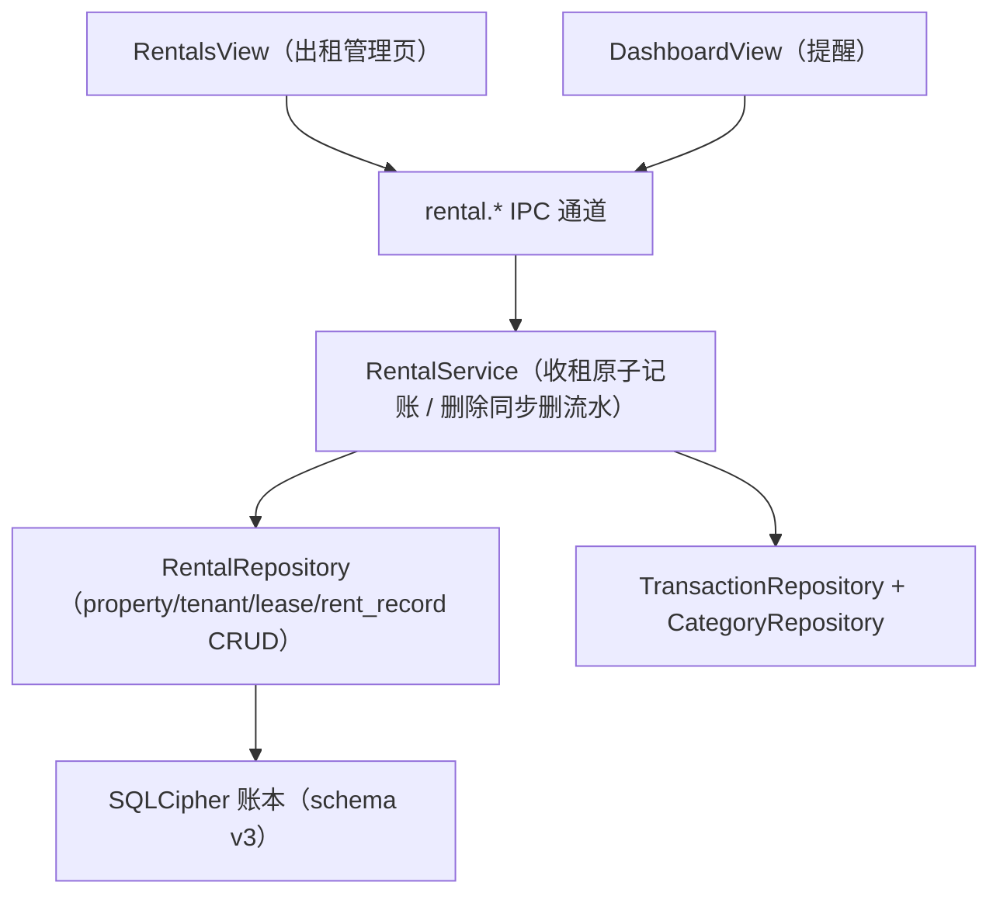

# 房屋出租管理

Feature Name: rental-management
Updated: 2026-08-12

## Description

在 tally 单机版财务工具中新增房屋出租管理能力：登记出租房、租户与租赁合同，按合同记录收租并自动生成收入流水，同时在仪表盘提供合同到期与应收租日提醒。

## Architecture



新增页面通过 `rental.*` IPC 通道与主进程交互；收租与删除收租的记账行为封装在 `RentalService`，保证「租金收入流水」与收租记录的一致性。

## Components and Interfaces

| 文件 | 职责 |
|------|------|
| `schema.ts` | `SCHEMA_VERSION` 升至 3，新增 rental_property/tenant/lease/rent_record 表（v2→v3 增量迁移） |
| `RentalRepository`（新增） | 出租房/租户/合同/收租记录的 CRUD 与聚合查询（合同收租记录、累计租金、应收租日） |
| `RentalService`（新增） | 记录收租（原子生成收入流水）、删除收租（同步删除关联流水） |
| `rental.handler.ts`（新增） | 注册 `rental.*` IPC 通道，参数校验与错误包装 |
| `preload/index.ts` | 暴露 `window.api.rental` |
| `RentalsView.vue`（新增） | 出租房/租户/合同/收租四个 tab 的管理界面 |
| `router/index.ts` + `App.vue` | 新增 `/rentals` 路由与侧边栏「出租」入口 |
| `DashboardView.vue` | 新增合同到期与应收租日提醒区块 |
| `utils/rental.ts`（新增） | 付租周期与应收租日计算、到期/应收提醒纯函数 |

### IPC 通道

```text
rental.listProperties / createProperty / updateProperty / deleteProperty
rental.listTenants / createTenant / updateTenant / deleteTenant
rental.listLeases / createLease / updateLease / terminateLease
rental.listRentRecords / recordRent / deleteRentRecord
rental.reminders        # 返回合同到期与应收租日提醒列表
```

### 校验规则

- 出租房：地址非空（≤200）、面积 ≥ 0、月租金 ≥ 0、押金 ≥ 0
- 租户：姓名非空（≤50）、电话 ≤20、证件号码 ≤30
- 合同：起止日期合法（起 ≤ 止）、月租金 > 0、付租周期 ∈ {monthly, quarterly, yearly}
- 收租：金额 > 0、日期合法、关联合同存在且未终止

## Data Models

```text
rental_property(id PK, address TEXT NOT NULL, area REAL NOT NULL DEFAULT 0,
                monthly_rent REAL NOT NULL DEFAULT 0, deposit REAL NOT NULL DEFAULT 0,
                note TEXT, asset_id INTEGER REFERENCES asset(id) ON DELETE SET NULL,
                created_at INTEGER NOT NULL)

tenant(id PK, name TEXT NOT NULL, phone TEXT, id_number TEXT, created_at INTEGER NOT NULL)

lease(id PK, property_id INTEGER NOT NULL REFERENCES rental_property(id) ON DELETE CASCADE,
      tenant_id INTEGER NOT NULL REFERENCES tenant(id),
      start_date TEXT NOT NULL, end_date TEXT NOT NULL,
      monthly_rent REAL NOT NULL, pay_cycle TEXT NOT NULL CHECK(pay_cycle IN ('monthly','quarterly','yearly')),
      status TEXT NOT NULL DEFAULT 'active' CHECK(status IN ('active','terminated')),
      terminated_at TEXT, note TEXT, created_at INTEGER NOT NULL)

rent_record(id PK, lease_id INTEGER NOT NULL REFERENCES lease(id) ON DELETE CASCADE,
            amount REAL NOT NULL CHECK(amount > 0), date TEXT NOT NULL,
            transaction_id INTEGER REFERENCES "transaction"(id) ON DELETE SET NULL,
            note TEXT, created_at INTEGER NOT NULL)
```

关联关系：
- 删除出租房 → 级联删除其合同；合同删除 → 级联删除其收租记录
- 删除租户前须无关联合同（校验拦截，需求 2.3）
- 删除收租记录 → 同步删除其关联的 income 流水（`RentalService` 内处理）
- 收入流水删除时不影响收租记录（`ON DELETE SET NULL`）

## Correctness Properties

1. **收租-流水一致性**：记录收租时，rent_record 与其 income 流水（分类「租金收入」，记入用户指定账户）在同一事务创建；任一失败整体回滚。
2. **删除级联**：删除收租记录在事务内删除 rent_record 与关联流水；流水删除失败则收租记录不删除。
3. **不可删约束**：存在 active 或历史合同关联的租户禁止直接删除，返回 `TENANT_HAS_LEASES`。
4. **应收租日**：`应收租日 = start_date + n×付租周期`，取大于等于当前日期的最小值；跨周期由日期算术推进。
5. **提醒规则**：合同到期提醒当 `end_date - today ≤ 30 天` 且 `status = active`；应收租提醒当距下一应收租日 ≤ 3 天且合同 active。

## Error Handling

| 错误 | 处理 |
|------|------|
| 删除有关联合同的租户 | 返回 `TENANT_HAS_LEASES`，前端提示先终止合同 |
| 收租金额非法/合同已终止 | 返回 `INVALID_AMOUNT` / `LEASE_NOT_ACTIVE` |
| 删除收租但流水删除失败 | 事务回滚，返回错误，不产生部分删除 |
| 合同日期非法 | 校验拦截返回 `INVALID_LEASE_DATES` |
| 出租房/租户/合同不存在 | 返回 `PROPERTY_NOT_FOUND` / `TENANT_NOT_FOUND` / `LEASE_NOT_FOUND` |

## Test Strategy

- **存储层单测**：CRUD、删除级联（删房级联删合同与收租）、租户关联合同删除拦截、收租-流水原子性（成功成对生成/失败回滚）、删除收租同步删流水。
- **纯函数单测**：付租周期应收租日计算、合同到期提醒边界（30 天/31 天/已终止）、应收租提醒边界（3 天/4 天）。
- **组件测试**：RentalsView 各 tab 表单提交与列表渲染、合同展示收租记录与累计租金。
- **E2E**：登记出租房与租户 → 创建合同 → 记录收租（断言生成租金收入流水与账户余额变化）→ 删除收租（断言流水同步删除）。

## References

[^1]: (requirements.md) - [房屋出租管理需求文档](requirements.md)
[^2]: (src/main/services/storage/schema.ts) - [schema 迁移（当前 SCHEMA_VERSION=2）](../../../src/main/services/storage/schema.ts)
[^3]: (src/main/services/credit.service.ts) - [原子记账服务模式参考](../../../src/main/services/credit.service.ts)
[^4]: (src/renderer/src/utils/credit.ts) - [提醒纯函数模式参考](../../../src/renderer/src/utils/credit.ts)
